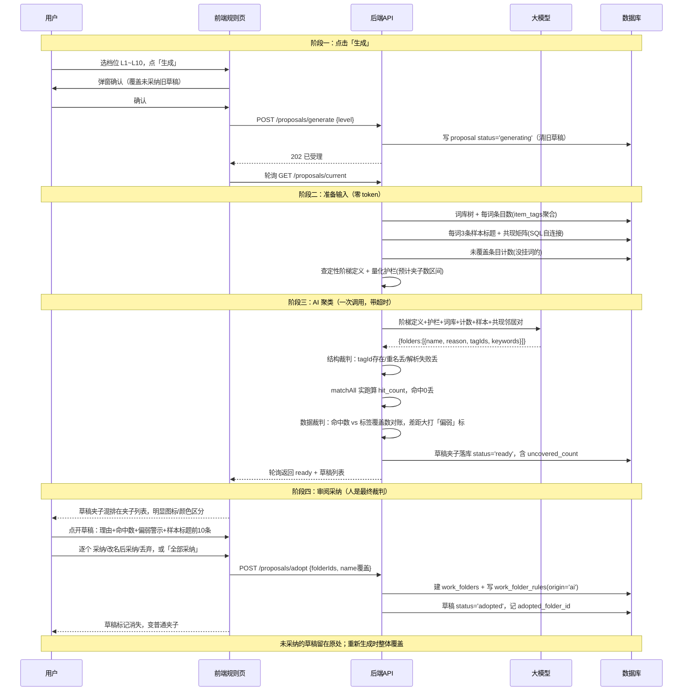

# 规则与标签 —— 夹子方案生成

> 2026-09-20 设计定稿。标签管理已完成（§9F 词库树 + 质检），本篇定义「一键生成整套夹子方案」功能。
> 每一步都写了两层：**它是干什么的**（大白话）+ 怎么做的（技术）。

## 一句话版本

> 你在界面上选一个「分多粗」的档位，点生成。系统把库里已整理好的标签词和视频信息打包，发给 AI，让它提出一套完整的夹子划分方案。系统先自动检查这套方案有没有瞎编（免费的代码检查），然后把过滤后的方案当草稿展示给你。你逐个审阅——觉得对的采纳成真夹子，觉得不对的丢掉。

## 背景

词库已经质检干净，名词都归好了类。同名概念下的视频就是「同类项」，同类项就是夹子的候选——但合并到多粗需要可调：

> 学习 Claude Code 和学习 DeepSeek harness，广义上都是 AI 编程，但用户和技术栈不同，是两个各不相同的概念；最松的情况下它们都算 AI Agent，稍紧一点又分成 Agent 方案分支 / harness 方案分支。所以要求从相关性严谨到松散可调——越严夹子越多越细，越松夹子越少越大。

核心交付物：**界面上选一个档位点「生成」，AI 产出一套完整的夹子方案草稿**（每个夹子叫什么、依据什么规则收哪些视频、预览命中数），人工审阅后采纳进工作台。

## 已确认决策

| 问题 | 决策 |
|------|------|
| 核心交付物 | 一键生成整套夹子方案（AI 出方案，人审阅采纳） |
| 与现有夹子关系 | 草稿层叠加，与 work_folders 并排展示；**草稿必须有明显图标/颜色区分** |
| 档位拧的是什么 | AI 按档位重新聚类；档位抽象 = **定性阶梯 + 量化护栏** |
| 聚类输入 | 词库树 + 每词条目数 + 每词样本标题（**不全量喂条目**） |
| 未挂词条目 | 不管，只报告未覆盖计数 |
| 草稿夹子构成 | 夹子名 + 规则（现有引擎四种字段）+ 命中数 + 理由一句话 |
| 采纳粒度 | 逐个采纳 / 改名后采纳 / 丢弃，另有「全部采纳」 |
| 草稿生命周期 | 单份草稿落库，重新生成时确认后整体覆盖 |
| 界面入口 | 规则页内集成（档位滑条 + 生成按钮；草稿混排在夹子列表） |

## 名词小词典

| 名词 | 大白话 |
|------|--------|
| 词库（tags 树） | 你已经质检过的标签体系，一个词就是一类概念，「篮球」下面可以有「NBA」 |
| 挂词 / item_tags | 每条视频挂了哪些词。「NBA 教程」这条视频挂着「NBA」「教程」 |
| token | AI 按字数收费的计量单位。省 token = 省钱省时间 |
| prompt | 发给 AI 的指令文本。AI 干活质量全看指令写得好不好 |
| 轮询 | 前端每隔几秒问一次后端「生成好了没」。项目里标注、质检都用这个模式 |
| matchAll | 项目里现成的规则匹配器：给它一组关键词，它告诉你每条视频命中了哪些 |
| 共现 | 两个词经常出现在**同一条视频**上。出现得越频繁，说明它们描述的内容越相关 |
| 共现矩阵 | 所有词两两配对的共现次数表（"矩阵"就是二维表格的数学叫法）。详见下面的小例子 |
| Jaccard 系数 | 共现次数的归一化：**同时挂两词的视频数 ÷ 挂过任一词的视频数**，0~1，越接近 1 越亲密。作用是把"真相关"和"万金油词跟谁都共现"区分开 |
| 命中数 | 按这个夹子的规则真跑一遍，实际能捞到多少条视频 |

### 共现矩阵小例子

假设库里只有 4 条视频：

| 视频 | 挂的词 |
|------|--------|
| ① NBA 规则讲解 | NBA、篮球 |
| ② 篮球投篮教学 | NBA、篮球 |
| ③ 居家健身教程 | 健身、教程 |
| ④ Claude Code 入门 | Claude Code、教程 |

数一遍两两共现（同时出现的视频数）：

| | 篮球 | 健身 | 教程 | Claude Code |
|---|---|---|---|---|
| **NBA** | 2 | 0 | 1 | 0 |
| **篮球** | | 0 | 1 | 0 |
| **健身** | | | 1 | 0 |
| **教程** | | | | 1 |

原始次数看不出亲疏——「教程」是万金油词，跟谁都共现。用 Jaccard 除一下：

- NBA ↔ 篮球：同时出现 2 条，沾边共 2 条 → **2÷2 = 1.0**（形影不离）
- NBA ↔ 教程：同时出现 1 条，沾边共 4 条 → **1÷4 = 0.25**（泛泛之交）

数字一除，"真相关"和"万金油"就分开了。在项目里的用途：这是**唯一不靠词面意思的证据**——AI 看不懂 `cc` 这种缩写，但"cc ↔ claude-code 共现 0.9、cc ↔ 健身 共现 0.01"是统计事实，AI 一看就知道该归哪边。

## 10 档定性阶梯

**它是干什么的**：档位就是你发给 AI 的「这次分多粗」的指令。没有它，AI 每次都按自己感觉分，松紧不可控。定义成 10 档固定的文字，每次生成效果就可预期：拧到 1 是细拆，拧到 10 是大归拢。

1 = 最严（夹子多而细）→ 10 = 最松（夹子少而大）。每档 = 名称 + 「成员之间共享什么才算同类」。

**进 prompt 的版本不带任何具体例子**——具体词（如 Claude Code）会让 AI 以为「库里该出现这些词」，或者让它往科技领域 bias。例子只留在本文档给人看：

| 档 | 名称 | 同类判定标准（prompt 原文） | 文档示例（仅人看） |
|----|------|---------------------------|------------------|
| 1 | 专精 | 围绕同一具体事物的同一具体用法/技巧 | Claude Code 快捷键技巧 |
| 2 | 工具 | 同一个具体事物/工具，不细分内部功能 | Claude Code 教程 |
| 3 | 方案 | 解决同一问题的同类工具或方案 | 各家 AI 编码助手 |
| 4 | 方向 | 同一技术路线/方法论 | Agent 框架、harness 方案 |
| 5 | 领域 | 同一领域，跨过方案之间的分歧 | AI 编程 |
| 6 | 邻域 | 领域 + 紧邻领域可合并 | AI / 机器学习 |
| 7 | 大类 | 同一大类，领域之上 | 人工智能 |
| 8 | 行业 | 同一行业 | 科技/数码 |
| 9 | 生活 | 生活大领域 | 学习 / 娱乐 / 日常 |
| 10 | 全收 | 全库归成几大主题 | —— |

AI 靠「具体用法 → 事物 → 方案 → 方向 → 领域 → 邻域 → 大类 → 行业 → 生活 → 全收」这条递进链理解松紧，一档比一档合并得更狠。

### 量化护栏

**它是干什么的**：光有定性定义，AI 有时分过头（把 3000 条视频分出 80 个夹子）或分不够（全塞进 2 个）。护栏就是顺手告诉它「按这个档位和你的库，预计该出几个夹子」，超出了说明它跑偏，你审阅时一眼能看出来。

**怎么做的**：由「有词条目数」+ 档位推出**预计夹子数区间**，写进 prompt 当边界、不当硬约束：L10 → 3~8 个；L1 → 上限约词库叶子数、封顶 50；中间档插值。

## 数据模型（两张新表）

**它是干什么的**：生成结果要存下来——生成一次是花钱花时间的，刷新页面就丢太可惜。两张表：一张记「这次生成」本身，一张记方案里的每个草稿夹子。

```sql
-- 方案头。CHECK(id=1) 钉死全局唯一一份（同 work_state 的做法）：
-- 整个库同时只有一份方案草稿，重新生成就是替换它
CREATE TABLE IF NOT EXISTS folder_proposals (
  id              INTEGER PRIMARY KEY CHECK (id = 1),
  level           INTEGER,              -- 本次生成用的档位 1~10
  uncovered_count INTEGER,              -- 没挂任何词的条目数，只报告
  status          TEXT NOT NULL,        -- 'idle' | 'generating' | 'ready'
  created_at      INTEGER
);

-- 草稿夹子。conditions_json 与 RuleCondition[] 同形，采纳后即普通规则
CREATE TABLE IF NOT EXISTS folder_proposal_folders (
  id                INTEGER PRIMARY KEY AUTOINCREMENT,
  proposal_id       INTEGER NOT NULL REFERENCES folder_proposals(id) ON DELETE CASCADE,
  name              TEXT NOT NULL,
  reason            TEXT,               -- AI 给的归类理由一句话
  conditions_json   TEXT NOT NULL,      -- {field:'tag'|'title', any:[...]}，空条件不生成
  hit_count         INTEGER NOT NULL,   -- matchAll 实跑结果
  weak              INTEGER NOT NULL DEFAULT 0,  -- 数据裁判「规则偏弱」警示标
  status            TEXT NOT NULL,      -- 'pending' | 'adopted' | 'discarded'
  adopted_folder_id INTEGER REFERENCES work_folders(id) ON DELETE SET NULL,
  created_at        INTEGER NOT NULL
);
```

生命周期：

- **单份可覆盖**：重新生成 = 事务内删旧行插新行（`ON DELETE CASCADE` 带走旧草稿）。
- **溯源**：采纳的草稿记 `adopted_folder_id`，能查到它变成哪个真夹子。
- **一键还原联动**：work_folders 被清时 `ON DELETE SET NULL` 让草稿自动回到可重审状态，不产生死引用。

## 生成流程：每一步在干什么



### 阶段一：发起生成

| 步骤 | 干什么 | 为什么 |
|------|--------|--------|
| 选档位点生成 | 你决定这次分多粗 | 松紧是你唯一要做的决策，其他全自动 |
| 弹窗确认 | 提醒「旧草稿会被覆盖」 | 生成花钱花时间且**不可复现**（同样的档位跑两次结果不同），误触丢掉上一次的结果太冤。整个功能唯一的确认弹窗，常规操作不弹 |
| 先落 `generating` 再干活 | 数据库先记一笔「正在生成」 | 这样刷新页面、关浏览器再回来，状态都不丢，轮询能接着查 |
| 202 受理 + 轮询 | 后端立刻应答「收到，正在做」，前端隔几秒问一次进度 | AI 生成要几十秒，不能让页面干等卡死。这是项目里标注/质检验证过的老模式 |

### 阶段二：备料（不花一分钱 token）

| 步骤 | 干什么 | 为什么 |
|------|--------|--------|
| 词库树 + 每词条目数 | 告诉 AI：库里有哪些概念、每个概念压着多少条视频 | 不给这个，AI 凭空想象概念大小，分出来的夹子头重脚轻（一个夹子 2000 条、另一个 3 条） |
| 每词 3 条样本标题 | 每个词抽几条真实视频标题给 AI 看一眼 | 词名可能看不懂（缩写、外文、梗），看标题才知道这词底下实际装的是什么内容。只抽 3 条是为了省 token——全库几千条标题全给的话又贵又慢 |
| 共现矩阵 | 纯数学算出「哪些词经常出现在同一条视频上」 | 这是**唯一不靠词面意思的证据**：`cc` 这种缩写 AI 看名字猜不出它是什么，但「`cc` 和 `claude-code` 共现 0.9」是统计事实，AI 一看就懂。SQL 一发算完，零成本 |
| 未覆盖条目计数 | 数一下有多少视频一个词都没挂 | 聚类按词走，没挂词的视频收不进任何夹子。把它们数出来告诉你，让你心里有数（不处理它们，见「明确不做」） |
| 阶梯定义 + 护栏区间 | 按你选的档位，查出对应的文字定义和预计夹子数 | 这两样就是下面发指令的「正文」 |

### 阶段三：AI 聚类 + 三道自动检查

| 步骤 | 干什么 | 为什么 |
|------|--------|--------|
| 一次 LLM 调用 | 把备好的料打包发给 AI：「按这个松紧度，提出一套夹子划分」 | 一次调用 = 一次的钱和时间。AI 返回：每个夹子的名字、理由一句话、挂哪些词、配哪些标题关键词 |
| 带超时 | 给这次调用设个最长等待时间 | 教训：模型挂起会卡死整轮，且停止按钮不生效。超时就判失败，重来 |
| 结构裁判 | 代码逐条检查 AI 的输出：词 id 真实存在吗？夹子重名吗？格式对吗？ | AI 会**编造**：引用词库里根本不存在的词、起两个一样的名字、输出格式坏掉。这些机器一眼能查出来，检查不过的直接扔 |
| 实跑命中数 | 拿 AI 给的规则，用项目现成的 matchAll 真跑一遍，数出实际命中多少条 | AI 说「这些关键词能捞到视频」不能信，要自己数。命中 0 的夹子（规则什么都捞不到）直接扔——留着只是占地方 |
| 数据裁判（偏弱警示） | 对账：AI 声称收编的词实际压着 800 条视频，但它的关键词只捞到 200 条 → 打「规则偏弱」标 | 说明 AI 的**概念是对的，但规则写弱了**——它描述了一筐东西，规则却捞不满。警示标不自动删除（概念可能有价值，你采纳后可以自己补关键词），只是审阅时提醒你多看一眼 |
| 落库 ready | 过了全部检查的草稿存进数据库，状态改「就绪」 | 前端轮询到 ready 就停止转圈，展示草稿 |

### 阶段四：审阅采纳（你是最终裁判）

| 步骤 | 干什么 | 为什么 |
|------|--------|--------|
| 草稿混排展示 | 草稿夹子和真夹子排在同一个列表里，但草稿有明显的图标/颜色 | 方案合不合理要放在现有夹子旁边看才直观。视觉区分保证你不会把草稿当成已生效的夹子 |
| 点开看证据 | 草稿卡片里展示：AI 的理由、命中数、偏弱警示、命中视频的 10 条标题样本 | 采纳的本质是「信不信这个概念」。证据摆齐了你才判得快——只有名字和理由的话，你只能瞎猜它里面装了什么 |
| 采纳 | 建一个真夹子 + 把规则写进规则引擎 | 采纳之后这条规则就永久生效：以后同步新视频进来，跑归类时命中规则的自动进夹子，不再需要 AI |
| 改名后采纳 | 用 AI 的概念和规则，名字换成你喜欢的 | AI 起名不一定合你口味，但概念划分本身可能是对的 |
| 丢弃 | 草稿标记为不要了 | 草稿留在库里但状态是 discarded，不影响任何东西 |
| 全部采纳 | 一键把所有 pending 的草稿全部采纳 | 你看完觉得整套都对时，不用一个个点 |

**为什么最后必须是人**：「这几个词算不算同类」「这个概念该不该存在」是语义判断，机器判不了。系统做到的是把证据摆齐、把瞎编的提前过滤掉，让你只花时间在真正的判断上。

## 裁判体系总览

| 层 | 谁裁 | 判什么 | 成本 |
|----|------|--------|------|
| ① 结构裁判 | 代码（自动） | 词 id 真实存在、不重名、格式合法、命中数 > 0 | 零 |
| ② 数据裁判 | 代码（自动） | 概念大小 vs 规则捞取量对账，差距大打「偏弱」警示；夹子间重叠率展示 | 零 |
| ③ 人 | 你 | 语义对不对。证据已摆齐：理由 + 命中数 + 警示 + 样本标题 | 审阅时间 |

自动检查全跑、结果可见、不弹待确认；人工只在采纳时出手。

### 共现相似度（配角，已加入）

**它是干什么的**：给 AI 一张客观的「词关联表」，别让它光凭词名猜。

- **怎么算**：两个词出现在同一条视频的次数多，就相关（Jaccard / PMI，纯 SQL，生成前算一次，零 token）。
- **当 AI 的输入**：每词附 top 邻居对（限量，共现 ≥0.3 左右）。
- **当裁判数字**：AI 声称这几个词同类，但它们的共现 ≈ 0 → 并入②的「规则偏弱」警示。
- **注意**：万金油词（如「教程」挂得到处都是）共现虚高，喂给 AI 时明确「共现是线索不是指令」。
- **刻意不做**：用共现阈值当档位刻度——档位就是定性阶梯，共现只是证据之一。

共现只测「一起出现」，测不出「语义同类」；主聚类始终是 AI，共现不替代它。

## 前端交互（规则页内集成）

- 规则页顶部：档位滑条（1~10，旁边显示档位名称与一句话定义）+「生成方案」按钮。
- 草稿夹子**混排在夹子列表**中，用明显图标/颜色区分（要求：一眼分辨草稿与真夹子）。
- 草稿卡片信息：名字、理由一句话、命中数、「规则偏弱」警示标（如有）。
- 点开草稿：命中条目样本标题前 10 条。
- 操作：采纳 / 改名后采纳 / 丢弃 / 全部采纳。
- 生成中：进度态（轮询），期间可中止（复用质检那套 UX）。

## 明确不做（YAGNI 记录）

- **LLM 当裁判**（第二个模型审第一个模型）——贵一次调用，只是把「信谁」往后挪一层；②的确定性对账更便宜更客观。哪天人工审阅太烦再考虑。
- **多份历史草稿对比**——管理复杂界面负担重；想要别的档位结果就重跑。
- **AI 补捞未覆盖条目**——只报计数，未挂词条目留在工作台未分类区。
- **共现阈值当档位刻度**——见上。
- **确定性/可复现聚类**——AI 生成天然不可复现，这正是「草稿层 + 人工采纳」结构存在的原因。
